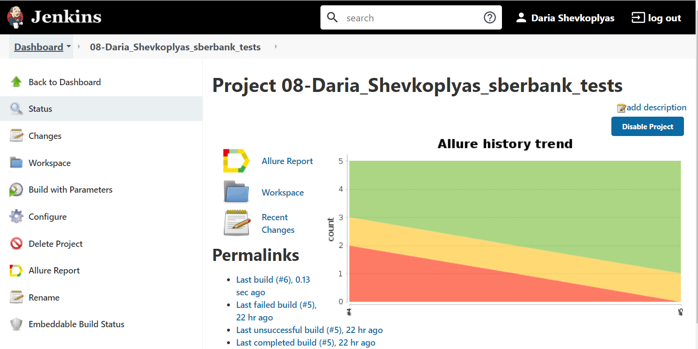
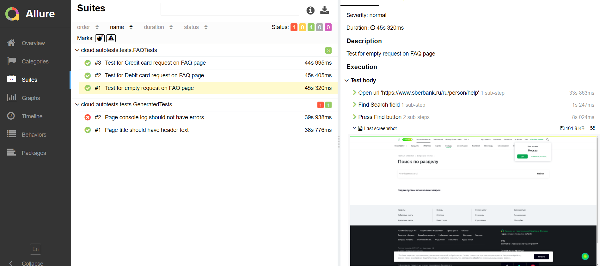
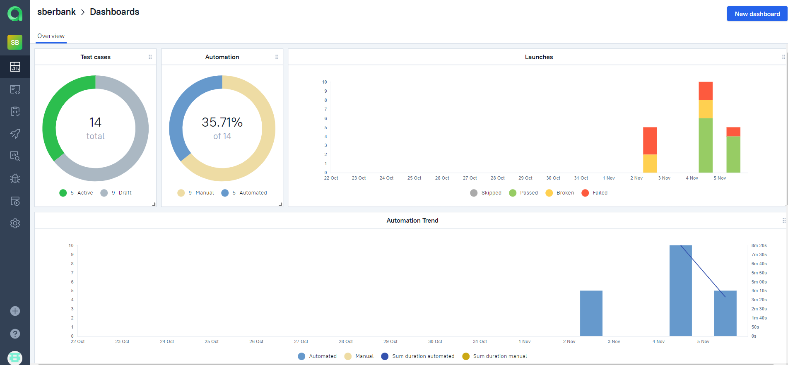
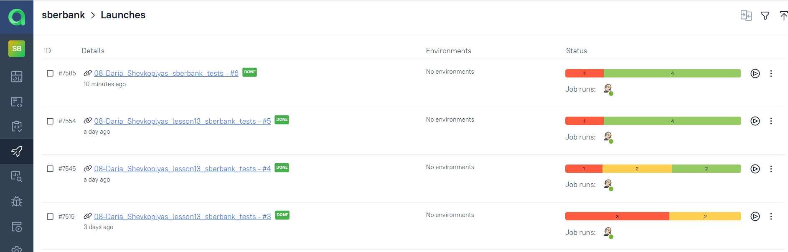
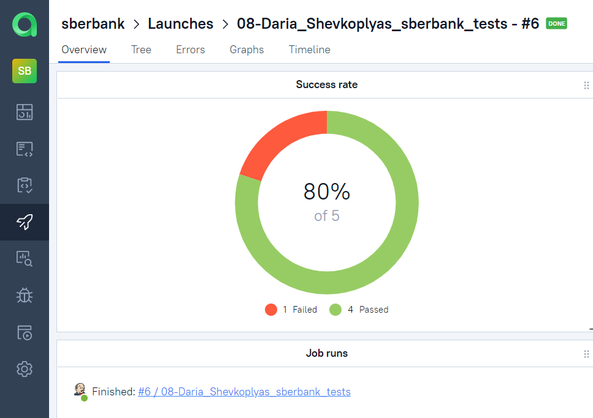
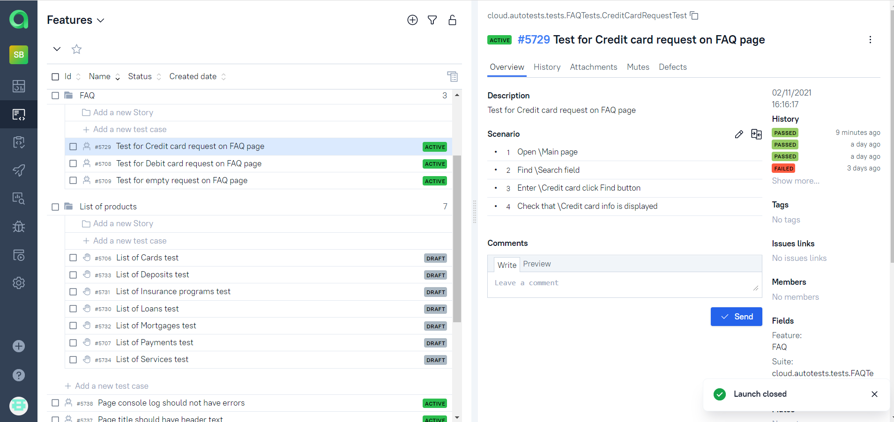
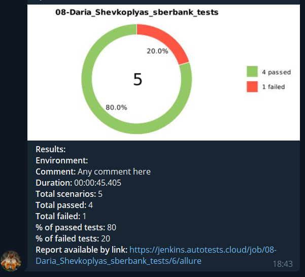

# Проект автотестов для сайта

<a target="_blank" href="www.sberbank.ru"/> www.sberbank.ru
________

### Создана задача для запуска тестов в CI Jenkins: 
<a target="_blank" href="https://jenkins.autotests.cloud/job/08-Daria_Shevkoplyas_sberbank_tests/">https://jenkins.autotests.cloud/job/08-Daria_Shevkoplyas_sberbank_tests/


Команда для запуска автотестов:
```bash
gradle clean test
```

Запустить автотесты:
```bash
gradle clean -DremoteDriverUrl=https://%s:%s@selenoid.autotests.cloud/wd/hub/ -Dthreads=1 test
```
____________

### Реализована возможность генерации отчета в Allure:
В отчетах сохранаются скриншоты и видео, записанные во время прохождения тестов, а также логи консоли браузера

[Отчет Allure](https://jenkins.autotests.cloud/job/08-Daria_Shevkoplyas_sberbank_tests/6/allure/#)


```bash
allure serve build/allure-results
```
______________

### Созданы ручные и автоматизированные тесты в TMS Allure TestOps:
На Dashboard'е можно увидеть количество ручных и автоматизированных тестов, а также статистику запусков




Запуски тестов (на вкладке Launches) отображаются автоматически в реальном времени при запуске задачи в Jenkins




Детальная информация по Запуску тестов



Ручные и автоматизированные тесты отображаются на вкладке Tests



________________

### Добавлена функция оповещений о запуске тестов в Telegram:
Оповещение с отчетом из Allure направляется в закрытый телеграм-канал при завершении прохождения тестов.



_____________

### Применяемый стек:

| Java | Selenide | Selenoid | Allure Report | Allure TestOps | JUnit5 | Jenkins | Gradle | Telegram |
|:----:|:----:|:------:|:------:|:------:|:----:|:----:|:------:|:------:|
|  |  |  | |  |  |  |  |  |

